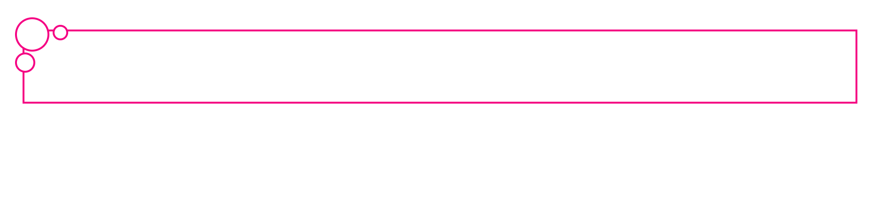

# Assignment-1: Create collage routine in HTML.
# Assignment-2: Create a web document to illustrate the following using CSS:
                       -Color
                       -Text formate
                       -backgroud
# Assignment-3: Buttons, Border, Color and Pseudo class.  
        -Create buttons as per given figure.  

        -Create borders as per given figure.  
  
# Assignment-4: Design Navbar, CTA, Hero section and 404 page.
        -As shown in the figure below, design 404 page.   
  

        -Design CTA section as shown in the figure below.  
     

        -As shown in the figure below, design Hero section.  
        

        -As shown in the figure below, design Navbar section.  
 
# Assignment-5: Develop  a simple calculator using HTML, CSS, and DOM in JS
# Assignment-6: Explain event bubbling and capturing with an example.
# Lab 1: HTML Elements
    Make a webpage with the following html elements:
        Nested order and unorder list
        semantics tags for the layout
        text formatting tags
        image, video and audio
        iframe
    Can add additional elements and CSS to make the webpage more visually appealing.  
# Lab 2: Flow layout and Positioned layout in CSS  
- *Create a wrapper element as shown in the figure below to fill the empty space in smaller viewports. It specifies a maximum width and will horizontally center itself within the parent if space is available. It includes some horizontal "breathing room" so that its children aren't pressed up against the viewport's edges.*         

hint: max-width
- *Design a circuit as shown in the figure.*

- *Design a decorative item as shown in the screenshot below.*  
   
# Lab-3: Fundamentals Javascript
-      WAP to reverse the string provided by the user. 
-      Write a function to check if the provided number is palindromic or not. 
-      Write a program to find the sum of prime number between 1 and 50. 
-      Write a function that reverse the provided array. 
-      Write a function that sorts the provided array based on the parameter (i.e. asc = ascending, desc = descending order).   
# Lab-4 : Event handling in Javascript  
-     Write a program to demonstrate page load event.  
-     Write JS code to illustrate element positioning, stacking elements and mouse cursor.  
-     Write JS function to validate a form input field for onblur event whether it is blank or not and contains number or not.  
-     Write JS code to find the factorial of a number requesting a number from user using prompt. Display result on button click.  
-     Create an HTML form that takes user's email address and password. Validate the form using JS when the submit button is clicked. Make sure that the fields   are not empty and the email address is a valid email address.  
-     Write a JS program which validates the user data (name, email, contact no, country) and displays the success message if validated successfully. Also create the HTML form for entering the data.

